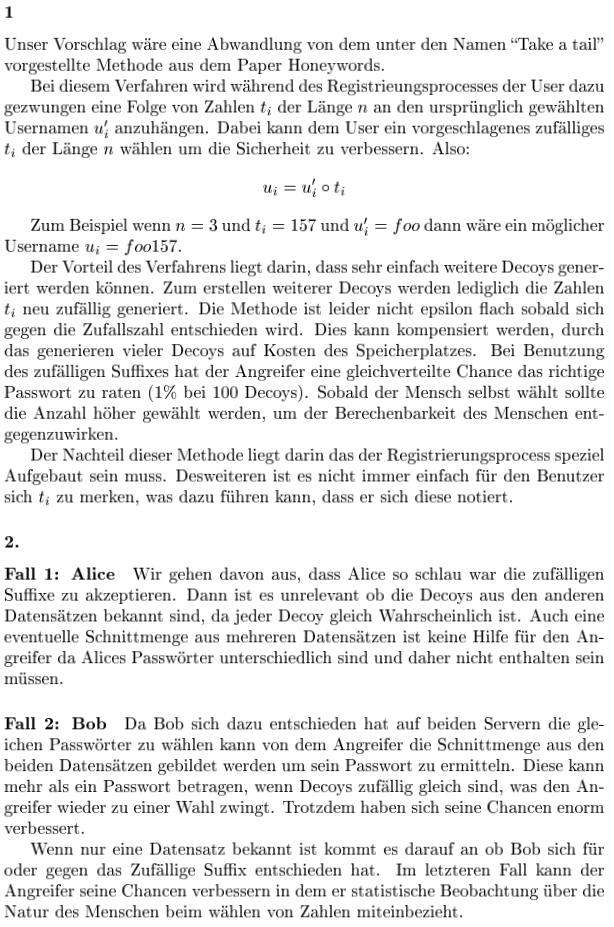
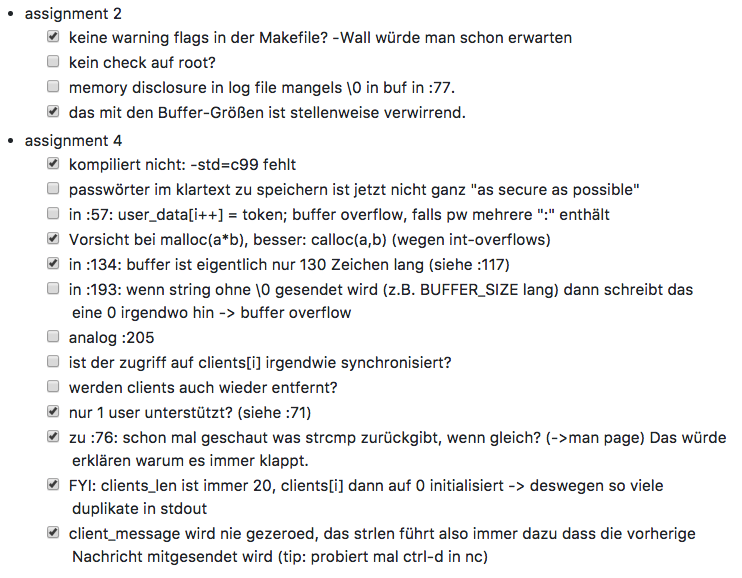
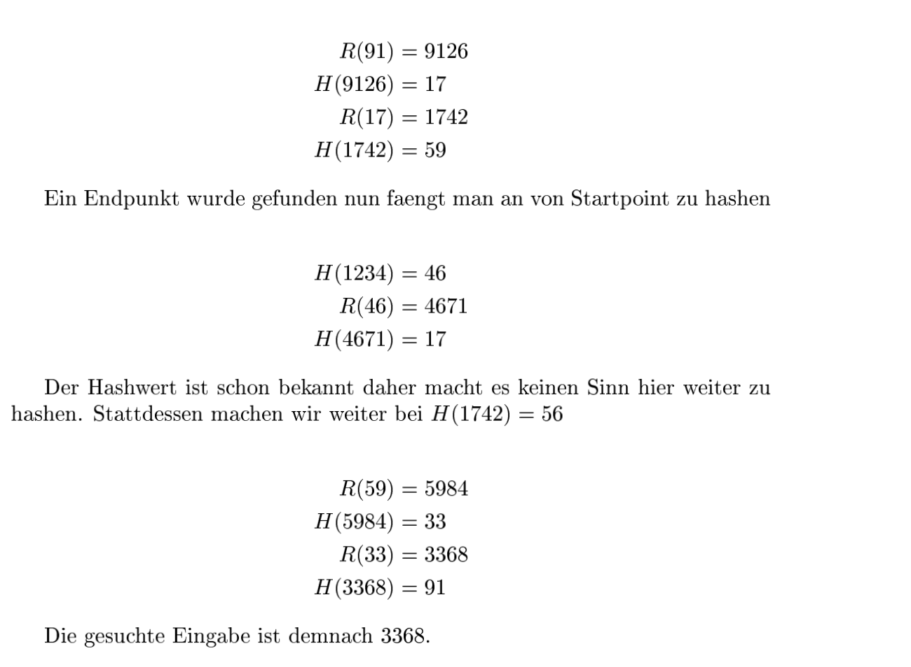
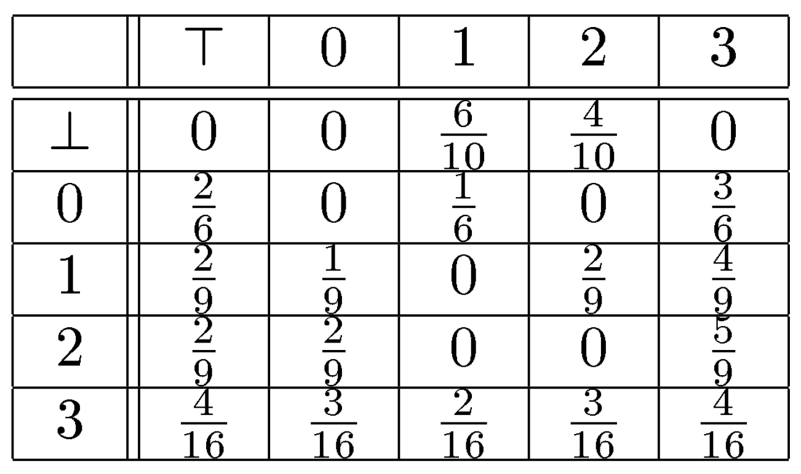
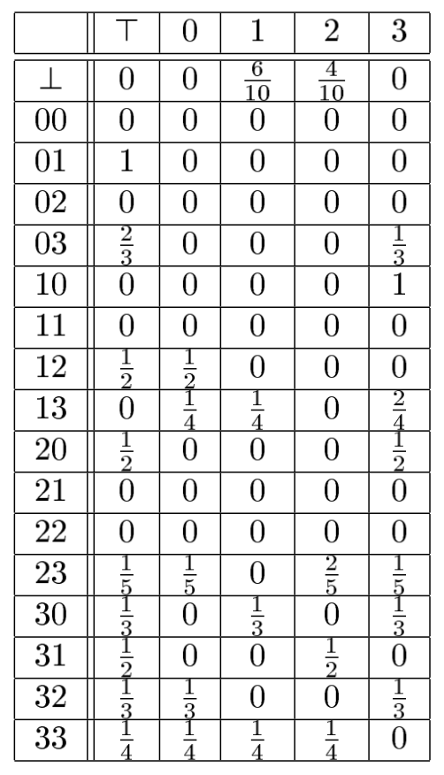
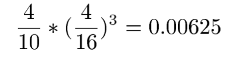

# Rechnersicherheit - SS17 - FU Berlin

## Gruppe:

- Jakob Krause, Master Informatik, 4573260
- Ramdane Sennoun, Master Informatik, 4304440


## Papers
- [OMEN: Faster Password Guessing Using an Ordered Markov Enumerator](https://hal.inria.fr/hal-01112124/document)
- [Martin Hellman: A cryptoanalytic time-memory trade-off)](http://www.karlin.mff.cuni.cz/~hojsik/ku/papers/Hellman_ACryptanalyticTime-MemoryTradeoff_1980.pdf)
- [Philippe Cechslim: Making a faster cryptoanalytic time-memory trade-off](http://pages.csam.montclair.edu/~perrieror/projects/CMPT495-clustering.and.security/resources/philippe.oechslin-making.a.faster.cryptanalytical.time.memory.trade.off.pdf)
- [Narayanan, Shmatrikov: Fast dictionary attacks on passwords using time-memory-trade-off]()

## Assignment 7

### Exercise 21 (Real world access control matrix (3 Points)).


### Exercise 23 (More programming mistakes... (1+2+1 Points + 1 Bonus)).

#### Part 1
On the stack you can find the stored registers `ebp` and `eip`. Also, the `buffer[]` is on the stack (run `info locals` in gdb).


#### Part 2
1. compiled `main.c` with `-g` flag
2. looked for the return address (saved eip) of the `pwCheck` function which we found on the stack
	1. firstly, we started with `gdb ./a.out`
	2. we set a breakpoint at line 15 (`return 0;`)
	3. continued with `run`
	4. Displayed stack info with `info frame` at the breakpoint for getting the address of the stored `eip`
	5. 	then we looked for the address of `buffer[]`
	6. we counted the memory distance between `buffer` and the stored `eip` 
	7. produce a buffer overflow to overwrite the stored eip
	8. Instead of jumping back into the main the program now jumps to the `doAccept()` function
8. Result: in our case on our Debian machine the password that worked was: ```printf "seventeencharssss\x5b\x84\x04\x08" | ./a.out```. The address was `0x804845b` which we found with `layout split` where the `doAccept()` function begins.
	
#### Part 3

On OpenBSD we got a segmentation fault (core dumped) with the same steps above (Part 2).

## Assignment 6

### Exercise 17 (Honeywords (3+2 Points)).



### Exercise 18 (x86 assembly recap (2 Points)).

See files.

### Exercise 19 (Case study μ-shout (II): Secure C Coding (2 Points + 1 Bonus)).

#### Part 1 Code:
See files for code.

#### Part 2 Notes:

This is a summary of the fixed issues. Not all issues were fixed yet. We fix more issues as we go.

 

Some of the variable names changed like `buf`. Also added more descriptive named constants. Still not an ideal solution. Password still need to be hashed. Variable accesses need to be synchronized. 

Another point: we need to implement a dynamic array solution for adding and removing connected clients. The access for that array also will need to be synchronized.

#### Part 3 Secure C Coding Rules:

We decided to take a look at rule 6:
[Rule 06. Arrays (ARR)](https://www.securecoding.cert.org/confluence/pages/viewpage.action?pageId=263) under [ARR32-C. Ensure size arguments for variable length arrays are in a valid range](https://www.securecoding.cert.org/confluence/display/c/ARR32-C.+Ensure+size+arguments+for+variable+length+arrays+are+in+a+valid+range).

We ensure that the passed index (i.e. adding `connected_client` the `clients` array) is in valid range.

We also decided to take a look at rule 48:
[Rule 48. Miscellaneous (MSC)](https://www.securecoding.cert.org/confluence/pages/viewpage.action?pageId=362) under [MSC37-C. Ensure that control never reaches the end of a non-void function](https://www.securecoding.cert.org/confluence/display/c/MSC37-C.+Ensure+that+control+never+reaches+the+end+of+a+non-void+function). 

In our `UShout` code all non void methods are returning a valid value in any case.

## Assignment 5

### Exercise 13 (Rainbow tables (3 Points)).



### Exercise 14 (x86 assembly recap (1+2 Points)).

Das E als Pre x gibt an das es sich um eine Registergröÿe von 32-Bit handelt.

##### ESP (Stack Pointer)
Das Register zeigt auf die Spitze des Stacks.

#####  EBP (Stack Base Pointer)
Das Register zeigt auf den Boden des Stacks.

#####  EIP (Instruction Pointer)
Das Register speichert die Adresse der folgende CPU Anweisung es sei den Branching ist möglich.

### Exercise 15 (Common mistakes / lessons learned (4 Points)).

We implemented the C-program and compiled it with `gcc` on our Debian machine.

Running the program (`./a.out`) prompts the user with `Password:`

Typing `password` as the password returns `Access Denied`.

An example password, that does not start with "password" is "helloworld", actually any string that has at least 10 characters. The programm has the following line of code: `char buffer [9];`. There is not enough space in `buffer`, since one extra char is needed for the terminating null character which causes overflowing bytes get written over.

```
Password OK
Segmentation fault
```

`objdump` displays information from an object or program including functions and read-only data. Option `-d` disassembles the data to make it more accessible.

See the `objdump_output.txt` file.


`gdb` (C debugger) was used to debug the c program: `gdb a.out`.

### Exercise 16 (Keeping your systems secure (Bonus: 1 Points)).
not solved

## Assignment 3

### Exercise 5 (Markov-Generator (5 Points)).

#### first-order Markov generator


#### second-order Markov generator



#### Give one 4-digit PIN number that is generated by your first-order Markov generator but not by your second-order generator and calculate it’s proba- bility.

Die PIN  2333  kann von dem 2. Model nicht generiert werden. Die Wahrschein- lichkeit dieser PIN beträgt:




### Exercise 6 (Bad Password Practice (1+2 Points)).

#### 6.1 Solution (Password popularity: 701-800)


#### 6.2 What did Adobe do wrong?

Adobe used 3DES, a block cipher, in ECB mode to encrypt the passwords. Therefore they made it easier for bruteforce methods because it is a fast encryption method. Their chose method requires a cipher password that needs to be in the system all the time. Therefor, if that cipher password gets published somehow, all the passwords can be revealed. It also gives information about the password length. 

### Exercise 7 (Randomized Response (2+1 Points)).

### Exercise 8 (Keeping your systems secure (Bonus: 1 Points)).

##### Debian
Since April 29th, 11.59pm there were 13 debian security announcemenets as of this writing.

- [SECURITY] [DSA 3840-1] mysql-connector-java Moritz Muehlenhoff
- [SECURITY] [DSA 3841-1] libxstream-java Moritz Muehlenhoff
- [SECURITY] [DSA 3842-1] tomcat7 security update Sebastien Delafond
- [SECURITY] [DSA 3843-1] tomcat8 security update Sebastien Delafond
- [SECURITY] [DSA 3844-1] tiff security update Moritz Muehlenhoff
- [SECURITY] [DSA 3845-1] libtirpc security update Moritz Muehlenhoff
- [SECURITY] [DSA 3846-1] libytnef security update Sebastien Delafond
- [SECURITY] [DSA 3847-1] xen security update Moritz Muehlenhoff
- [SECURITY] [DSA 3848-1] git security update Salvatore Bonaccorso
- [SECURITY] [DSA 3849-1] kde4libs security update Salvatore Bonaccorso
- [SECURITY] [DSA 3850-1] rtmpdump security update Moritz Muehlenhoff
- [SECURITY] [DSA 3851-1] postgresql-9.4 security update Moritz Muehlenhoff
- [SECURITY] [DSA 3852-1] squirrelmail security update Sebastien Delafond

The list was extracted from [https://lists.debian.org/debian-security-announce/2017/threads.html](https://lists.debian.org/debian-security-announce/2017/threads.html)

###### [SECURITY] [DSA 3848-1] git security update
The Git git-shell, a restricted login shell for Git-only SSH access, allows a user to run an interactive pager by causing it to spawn `git upload-pack --help`.

They recommend to upgrade the git packages.

#### OpenBSD

Since April 29th, 11.59pm there were 7 OpenBSD 6.1 security announcemenets as of this writing.

- 001: INTEROPERABILITY FIX: May 2, 2017   All architectures 
dhcpd unconditionally echoed the client identifier, preventing some devices from acquiring a lease. 
A source code patch exists which remedies this problem.
- 002: SECURITY FIX: May 2, 2017   amd64 
vmm mismanaged floating point contexts. 
A source code patch exists which remedies this problem.
- 003: SECURITY FIX: May 2, 2017   All architectures 
A consistency check error could cause programs to incorrectly verify TLS certificates when using callbacks that always return 1. 
A source code patch exists which remedies this problem.
- 004: RELIABILITY FIX: May 2, 2017   All architectures 
softraid was unable to create usable concat volumes because it always set the size of the volume to zero sectors. 
A source code patch exists which remedies this problem.
- 005: RELIABILITY FIX: May 6, 2017   All architectures 
Expired pf source tracking entries never got removed, leading to memory exhaustion. 
A source code patch exists which remedies this problem.
- 006: RELIABILITY FIX: May 8, 2017   All architectures 
Incorrect DTLS cookie handling can result in a NULL pointer dereference. 
A source code patch exists which remedies this problem.
- 007: SECURITY FIX: May 13, 2017   All architectures 
Heap-based buffer overflows in freetype can result in out-of-bounds writes. 
A source code patch exists which remedies this problem.

The list was extracted from [https://www.openbsd.org/errata61.html](https://www.openbsd.org/errata61.html)

## Assignment 2

### Exercise 3 (Case study μ-shout (I): a small echo server (6 Points)).

- see files

###Exercise 4 (Real-world de-anonymization 2+2 Points).
####Read https://33bits.org/2008/11/12/57/ and download the current “Loan Data” history from https://www.lendingclub.com/info/statistics.action.
1. ####The blog post from above is quite old. Which steps can you identify that Lending Club has taken to “anonymize” the data?

	According to their privacy policy they "protect personal information from unauthorized access and use by using security measures that comply with federal law. These measures include computer safeguards and secured files and buildings."
	
	Their security notice says: "Physical safeguards like access badges and a video monitoring system protect Lending Club from unauthorized access. Administrative safeguards like a security training program, employment background checks, and access controls ensure that your information is accessed only by trained and trusted staff based on business needs to provide services to you. Technical safeguards like perimeter security, industry standard encryption, two-factor authentication, and continuous monitoring ensure that your information is protected with layered and complementary controls. We review and adjust security safeguards periodically based on ongoing risk assessment. However, despite our substantial investment in protecting your personal information, ultimately no institution can guarantee its absolute security."
	
	They use methods like Encryption & website certificates, Session time-outs, passwords and Identity theft protection to protect personal information.
	
	We downloaded the 2017 Q1 loan data and the data dictionary to understand the meaning of each field. So, to "anonymize" their customers data they just didn't include fields like first_name and last_name. That does not matter because they can be "de-anonymized" with data fields like location or job and searching that in combinatino with their screenname and other sensitive information that can be taken from the data.
	 Also, to "hide" their location they xx-ed out the last two digits of the zip code.
	 
	 Compared to an older data set it seems like they removed the detailed loan description and categorized the loan instead, i.e. "Dept consolidation" or "major purchase".
	 
	 We also don't see the screen name anymore like the blog post decribed it.
	
	
2. ####Find the identity (name or social-media account or homepage, etc) of one lender and describe your process (note that some lenders are easier to identify than others).

	We downloaded an older data set (2007 - 2011). We were looking for unique job descriptions and found this entry:
	
	```
	,"","7000","7000","7000"," 60 months"," 15.96%","170.08","C","C5","Southern Star Photography","8 years","RENT","47004","Not Verified","Dec-2011","Fully Paid","n","","  Borrower added on 12/18/11 > I am planning on using the funds to pay off two retail credit cards with 24.99% interest rates, as well as a major bank credit card with a 18.99% rate.  I pay all my bills on time, looking for a lower combined payment and lower monthly 
	```	
	
	All we needed to do was googling Southern Star Photography for North Carolina and we are pretty sure we found the lender. Even pictures from his family were accessible:
	
	[His public Facebook page](https://www.facebook.com/Southern-Star-Photography-LLC-226798037400135/)
	
	
	
	For the most recent data set we tried a similar approach. We searched for entries that contained LLC and came across this entry:
	
	```
	,"","21300","21300","21300"," 36 months"," 19.99%","791.48","D","D4","Kennedy Transport, LLC","3 years","MORTGAGE","47360","Verified","Feb-2017","Current","n","","","debt_consolidation","Debt consolidation","712xx","LA","24.35","3","Aug-1985","0","18","","9","0","18327","79%","19","f","20419.41","20419.41","1535.65","1535.65","880.59","655.06","0.0","0.0","0.0","Apr-
	```
	
	We searched the company name and found these entries which matched the location "LA" and which seems to be operated by one person:
	
	- [Company](http://www.quicktransportsolutions.com/truckingcompany/louisiana/kennedy-transport-llc-usdot-542376.php)
	- [Empty Facebook Page](https://www.facebook.com/pages/Kennedy-Transport-LLC/563243510416531)
	- [Company Profile on movers.com](http://www.movers.com/trucking-transportation/kennedy-transport-llc.html) which has address and contact information which will lead to the person	
	
	
### Exercise 5 (Keeping your systems secure (Bonus: 1 Points)).
####Are there any new vulnerabilities for your Debian or OpenBSD system since last week (29.04.2016 at 23.59)? If so: state one, name the programming mistake, decide if you are affected or not, and report if there are any known work-arounds or patches.


Not solved
