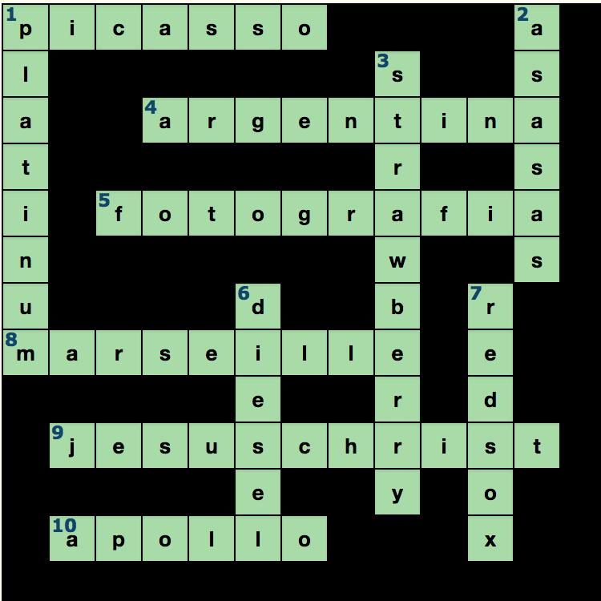

# Rechnersicherheit

Jakob Krause, Master Informatik, 4573260
Ramdane Sennoun, Master Informatik, 4304440


## Papers
- [OMEN: Faster Password Guessing Using an Ordered Markov Enumerator](https://hal.inria.fr/hal-01112124/document)


### Assignment 3

#### Exercise 5 (Markov-Generator (5 Points)).

#### Exercise 6 (Bad Password Practice (1+2 Points)).

##### 6.1 Solution (Password popularity: 701-800)


##### 6.2 What did Adobe do wrong?


#### Exercise 7 (Randomized Response (2+1 Points)).

#### Exercise 8 (Keeping your systems secure (Bonus: 1 Points)).

## Assignment 2

### Exercise 3 (Case study μ-shout (I): a small echo server (6 Points)).

- see files

###Exercise 4 (Real-world de-anonymization 2+2 Points).

####Read https://33bits.org/2008/11/12/57/ and download the current “Loan Data” history from https://www.lendingclub.com/info/statistics.action.

1. ####The blog post from above is quite old. Which steps can you identify that Lending Club has taken to “anonymize” the data?

	According to their privacy policy they "protect personal information from unauthorized access and use by using security measures that comply with federal law. These measures include computer safeguards and secured files and buildings."
	
	Their security notice says: "Physical safeguards like access badges and a video monitoring system protect Lending Club from unauthorized access. Administrative safeguards like a security training program, employment background checks, and access controls ensure that your information is accessed only by trained and trusted staff based on business needs to provide services to you. Technical safeguards like perimeter security, industry standard encryption, two-factor authentication, and continuous monitoring ensure that your information is protected with layered and complementary controls. We review and adjust security safeguards periodically based on ongoing risk assessment. However, despite our substantial investment in protecting your personal information, ultimately no institution can guarantee its absolute security."
	
	They use methods like Encryption & website certificates, Session time-outs, passwords and Identity theft protection to protect personal information.
	
	We downloaded the 2017 Q1 loan data and the data dictionary to understand the meaning of each field. So, to "anonymize" their customers data they just didn't include fields like first_name and last_name. That does not matter because they can be "de-anonymized" with data fields like location or job and searching that in combinatino with their screenname and other sensitive information that can be taken from the data.
	 Also, to "hide" their location they xx-ed out the last two digits of the zip code.
	 
	 Compared to an older data set it seems like they removed the detailed loan description and categorized the loan instead, i.e. "Dept consolidation" or "major purchase".
	 
	 We also don't see the screen name anymore like the blog post decribed it.
	
	

2. ####Find the identity (name or social-media account or homepage, etc) of one lender and describe your process (note that some lenders are easier to identify than others).

	We downloaded an older data set (2007 - 2011). We were looking for unique job descriptions and found this entry:
	
	```
	,"","7000","7000","7000"," 60 months"," 15.96%","170.08","C","C5","Southern Star Photography","8 years","RENT","47004","Not Verified","Dec-2011","Fully Paid","n","","  Borrower added on 12/18/11 > I am planning on using the funds to pay off two retail credit cards with 24.99% interest rates, as well as a major bank credit card with a 18.99% rate.  I pay all my bills on time, looking for a lower combined payment and lower monthly 
	```	
	
	All we needed to do was googling Southern Star Photography for North Carolina and we are pretty sure we found the lender. Even pictures from his family were accessible:
	
	[His public Facebook page](https://www.facebook.com/Southern-Star-Photography-LLC-226798037400135/)
	
	
	
	For the most recent data set we tried a similar approach. We searched for entries that contained LLC and came across this entry:
	
	```
	,"","21300","21300","21300"," 36 months"," 19.99%","791.48","D","D4","Kennedy Transport, LLC","3 years","MORTGAGE","47360","Verified","Feb-2017","Current","n","","","debt_consolidation","Debt consolidation","712xx","LA","24.35","3","Aug-1985","0","18","","9","0","18327","79%","19","f","20419.41","20419.41","1535.65","1535.65","880.59","655.06","0.0","0.0","0.0","Apr-
	```
	
	We searched the company name and found these entries which matched the location "LA" and which seems to be operated by one person:
	
	- [Company](http://www.quicktransportsolutions.com/truckingcompany/louisiana/kennedy-transport-llc-usdot-542376.php)
	- [Empty Facebook Page](https://www.facebook.com/pages/Kennedy-Transport-LLC/563243510416531)
	- [Company Profile on movers.com](http://www.movers.com/trucking-transportation/kennedy-transport-llc.html) which has address and contact information which will lead to the person	
	
	
### Exercise 5 (Keeping your systems secure (Bonus: 1 Points)).
####Are there any new vulnerabilities for your Debian or OpenBSD system since last week (29.04.2016 at 23.59)? If so: state one, name the programming mistake, decide if you are affected or not, and report if there are any known work-arounds or patches.


Not solved
